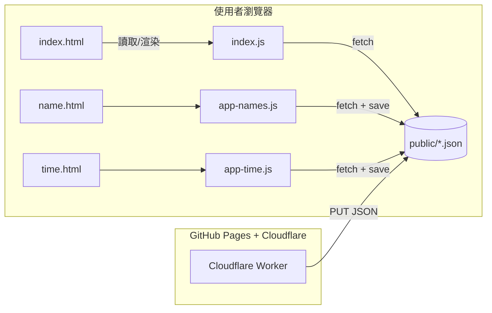

# 天堂 BOSS 時間管理系統 — 架構說明

**最後更新**：2025-08-28  
**負責人**：Hades  

---

## **1. 專案目的**
這個系統用於 **天堂 BOSS 時間管理**，提供以下功能：
- 顯示各 BOSS 重生時間，直觀卡片排序
- 即時編輯 BOSS 名稱與重生時間
- 支援多 JSON 檔案（不同伺服器 / BOSS 清單）
- 避免 GitHub Pages 部署延遲問題 → 改用 **Cloudflare Worker** 即時提交

---

## **2. 專案檔案結構**
```
/site/reorder/
│
├── index.html          # 首頁，顯示卡片式 BOSS 時間列表
├── index.js            # 首頁邏輯，負責讀取 JSON、渲染卡片、PNG 匯出
├── name.html           # 名稱編輯器（只允許編輯名字 & 順序）
├── app-names.js        # 名稱編輯器邏輯（保留時間資料）
├── time.html           # 時間編輯器（顯示名稱，編輯重生時間）
├── app-time.js         # 時間編輯器邏輯（嚴格 24H + 自動日期判定）
├── editor.css          # 共用編輯器樣式
├── common.js           # 共用模組，提供：
│   ├── 讀取 JSON 檔案（支援 ?file=）
│   ├── 儲存 JSON → Cloudflare Worker
│   ├── 產生保留 ?file= 的 URL
│   └── 取得 GitHub 最後更新時間
└── ARCHITECTURE.md     # **系統架構說明文件**（本檔案）
```

---

## **3. 資料流與互動流程**

### **3.1 前端**
| 模組          | 功能 |
|--------------|------|
| **index.html + index.js** | 顯示卡片列表、依時間排序、匯出 PNG |
| **name.html + app-names.js** | 編輯 BOSS 名稱 & 排序，不修改時間 |
| **time.html + app-time.js** | 嚴格 24H 時間輸入，支援 **-12 小時**日期推算 |
| **editor.css** | 統一編輯器樣式 |

### **3.2 JSON 檔案**
- 所有資料存放於 `/public/*.json`
- 透過 `?file=xxx.json` 切換不同伺服器或 BOSS 清單
- 範例：
```json
[
  ["惡魔王", "2231"],
  ["地獄犬", "0930"],
  ["幽靈", null]
]
```

### **3.3 Cloudflare Worker**
| 功能 | 說明 |
|------|------|
| 即時提交 JSON | 取代 GitHub Actions，避免延遲 |
| 回傳儲存結果 | 更新時間立即可見 |
| API URL | `https://hadeseidolon-json-saver.b5cp686csv.workers.dev/api/save` |

---

## **4. 主要邏輯摘要**

### **4.1 JSON 讀取**
- 從 `/public/*.json` 直接讀取，附帶 `?ts=${Date.now()}` 避快取
- 可透過 `?file=xxx.json` 指定檔案

### **4.2 JSON 儲存**
- 使用 **Cloudflare Worker**
- 送出 `path`、`content`、`message`
- Worker 負責更新 GitHub，無需等 GitHub Actions

### **4.3 時間規則**
- **嚴格 24H 輸入**（2 → 小時上限 23）
- 若輸入時間比 **現在時間早 12 小時以上** → 自動視為「明天」
- UI 只顯示 **HH:mm**，不顯示日期

---

## **5. 未來擴充**
- [ ] 新增 **手機版 RWD** 支援
- [ ] 多 JSON 選單（伺服器 / 世界 BOSS 清單）
- [ ] 優化 Worker → 直接回傳最後更新時間
- [ ] 增加系統錯誤監控（例如 JSON 解析錯誤、儲存失敗）

---

## **6. 系統架構圖**


---

## **7. 最後更新**
- **2025/08/28** - 建立初版架構文件
- 之後若有新增檔案或 API，請同步更新此檔案
